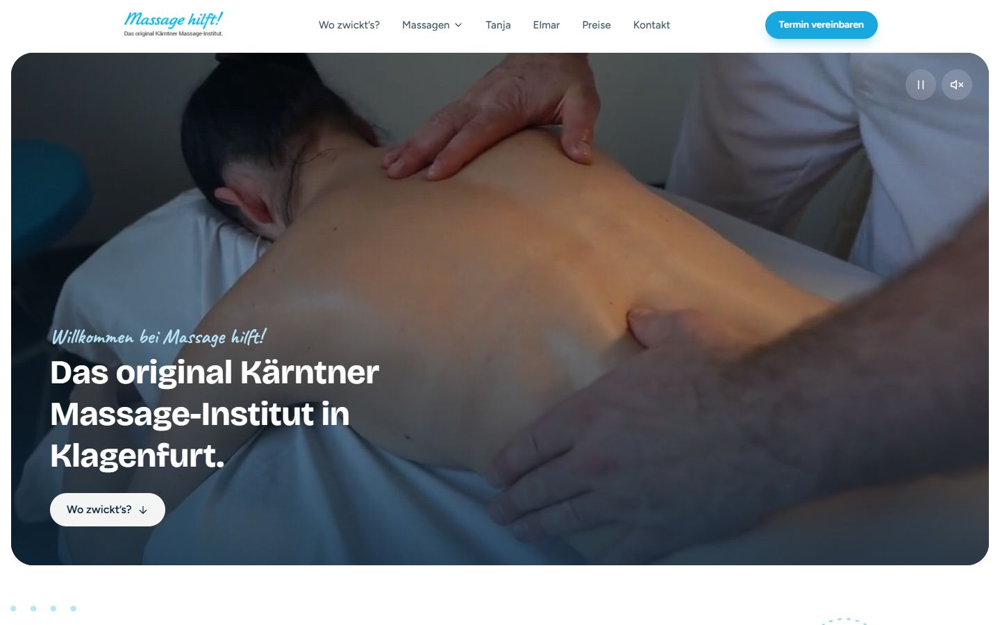
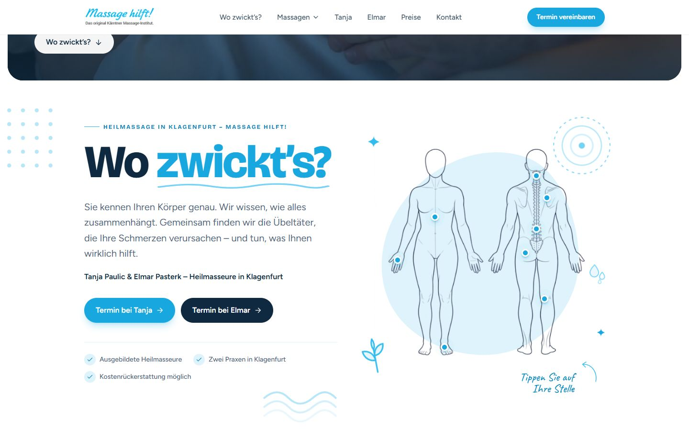
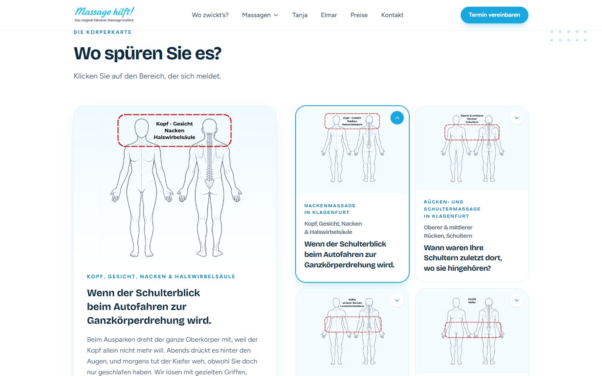
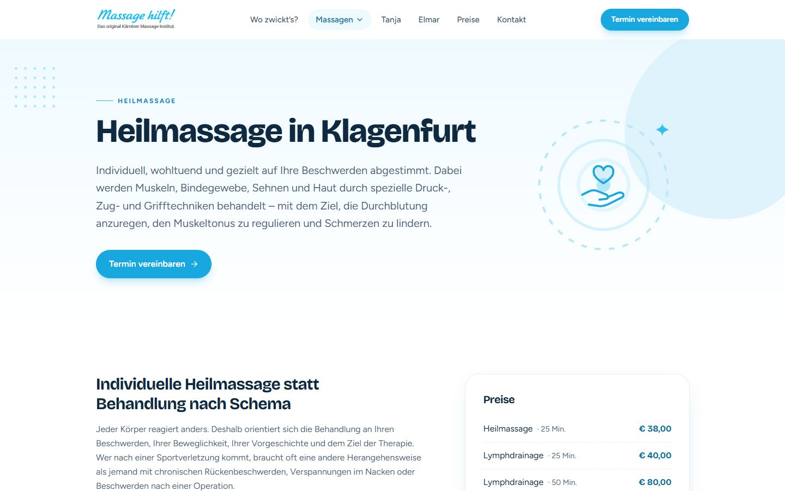

# Massage hilft! – massage-hilft.at

**Moderne Landingpage für Heilmassage in Klagenfurt.**
Die Website von *Massage hilft!* – dem original Kärntner Massage-Institut mit zwei eigenständigen Praxen von
**Tanja Paulic** (Ebentaler Straße) und **Elmar Pasterk** (Pischeldorfer Straße). Sie holt Besucher:innen bei ihren
Beschwerden ab, erklärt verständlich, was eine Heilmassage leisten kann, und führt ohne Umwege zum Termin –
per Anruf, Mail oder WhatsApp.



---

## Worum es geht

Die meisten Menschen suchen nicht nach „Heilmassage“, sondern nach einer Lösung für *ihr* Problem: der steife Nacken,
das Kreuz nach der Autofahrt, die schweren Beine am Abend. Die Seite ist deshalb nicht als Leistungskatalog aufgebaut,
sondern als Gespräch:

> **Wo zwickt’s?** – Sie kennen Ihren Körper genau. Wir wissen, wie alles zusammenhängt.

Aufbau nach dem 6-Schritte-Rahmen (Schmerzpunkt → Verständnis → Warum wir → Angebot → Einwände → Termin) und
StoryBrand: Die Besucher:innen sind die Held:innen, Tanja und Elmar die Guides. Alle Texte sind sachlich formuliert –
ohne Heilversprechen, wie es die Werberegeln für Gesundheitsberufe verlangen.

## Die Seite im Überblick

| Bereich | Was er tut |
|---|---|
| **Intro-Video** | Kurzer Einblick in die Praxis direkt beim Laden – startet stumm, Ton & Pause per Button |
| **Hero „Wo zwickt’s?“** | Körperillustration mit klickbaren Punkten (Nacken, Kreuz, Waden …) – ein Klick springt zum passenden Bereich der Körperkarte |
| **Schmerzpunkt** | „Dort, wo es weh tut, liegt selten die Ursache.“ – holt Besucher:innen bei ihrem Alltag ab |
| **Körperkarte** | 8 Körperbereiche als Kacheln mit Szenen-Headline („Wenn das Gurkenglas plötzlich gewinnt.“) und aufklappbarer Erklärung |
| **Warum wir** | Was ein Heilmasseur ist, Kostenrückerstattung, „Lieber Tanja oder lieber Elmar?“ |
| **Angebot** | Beide Praxen mit Kontakt-Buttons, Heilmassage, Lymphdrainage, MANNEA-Methode und „So einfach geht’s“ in 3 Schritten |
| **Rezensionen** | Echte Google-Bewertungen |
| **FAQ** | Häufige Fragen zu Verordnung, Kosten, Ablauf, Bezahlung |
| **Kontakt** | Beide Praxen mit Click-to-Call, Mail, WhatsApp (Tanja) und Anfahrt |

<table>
  <tr>
    <td width="68%"></td>
    <td></td>
  </tr>
  <tr>
    <td colspan="2"></td>
  </tr>
</table>

### Unterseiten

- **Tanja Paulic** & **Elmar Pasterk** – eigene Seite je Person mit Werdegang, Behandlungen und Kontakt
- **Behandlungen** – Heilmassage, Lymphdrainage, Entspannungsmassage, Hot Stone Massage, MANNEA-Methode,
  jeweils mit Preisen und eigenen FAQ
- **Preise & Gutscheine**, **Impressum**, **Datenschutz**, eigene **404-Seite**



## Features

- 📱 **Mobile first** – feste Leiste unten mit „Tanja anrufen“, WhatsApp und „Elmar anrufen“
- 🔎 **SEO pro Seite** – eigener Title, Description, Canonical, Open Graph und strukturierte Daten
  (LocalBusiness je Praxis, Person, Service mit Preisen, FAQPage, BreadcrumbList)
- ⚡ **Static Site Generation** mit vite-ssg – jede Seite ist fertiges HTML, schnell und für Suchmaschinen & KI-Crawler lesbar
- 🗺️ **sitemap.xml & robots.txt** werden beim Build automatisch erzeugt
- 🍪 **DSGVO-konform** – Google Analytics nur nach Einwilligung im Cookie-Banner, Schriftarten lokal statt von Google Fonts
- 🎨 **Eigene blaue Linien-Illustrationen** (SVG) passend zum Logo, helles und freundliches Design
- ♿ **Barrierearm** – semantisches HTML, Tastaturbedienung, Alt-Texte, reduzierte Animationen auf Wunsch

## Technik

| | |
|---|---|
| Framework | [Vue 3](https://vuejs.org) (Composition API, `<script setup>`) |
| Build | [Vite](https://vite.dev) + [vite-ssg](https://github.com/antfu-collective/vite-ssg) |
| Styling | [Tailwind CSS 4](https://tailwindcss.com) |
| Routing / Head | vue-router, @unhead/vue |
| Schriften | Bricolage Grotesque, Figtree, Caveat (lokal via Fontsource) |
| Hosting | nginx auf eigenem Server |

## Loslegen

Voraussetzung: [Node.js](https://nodejs.org) 20.19 oder neuer (von Vite 8 verlangt).

```bash
npm install
npm run dev       # Entwicklung mit Hot Reload → http://localhost:5173
npm run build     # vite-ssg: jede Seite als HTML nach dist/, inkl. sitemap.xml & robots.txt
npm run preview   # dist/ lokal ansehen, genau wie auf dem Server → http://localhost:4173
npm run deploy    # Build + Upload auf den Server (deploy.ps1)
```

> `npm run dev` rendert **nicht** vor – dort entsteht die Seite im Browser. Das fertige SSG-HTML gibt es nur nach
> `npm run build`, anzusehen mit `npm run preview`.

## Projektstruktur

```
src/
├── data/               ← Inhalte: Texte, Preise, FAQ, Kontaktdaten, Impressum, Datenschutz
│   ├── home.js           Körperbereiche, Leistungen, FAQ, Rezensionen
│   ├── practitioners.js  Tanja & Elmar: Kontakt, Bio, Angebot, Impressum
│   ├── treatments.js     Behandlungsseiten & Preisliste
│   ├── privacy.js        Datenschutzerklärung
│   └── schema.js         strukturierte Daten (JSON-LD)
├── views/              ← Seiten (Home, Person, Behandlung, Preise, Rechtliches, 404)
├── components/         ← Header, Footer, Kontakt, Cookie-Banner, Illustrationen …
│   └── home/             Abschnitte der Startseite (Video, Hero, Körperkarte …)
├── composables/        ← useSeo, useCookieConsent, useBodyMap, usePageTracking
├── router/             ← alle Routen (werden automatisch vorgerendert)
└── main.js             ← Einstieg (ViteSSG)
public/video/           ← komprimiertes Intro-Video + Standbild
deploy/nginx.conf       ← nginx-Konfiguration für den Server
scripts/preview.mjs     ← lokale Vorschau des Builds
```

### Inhalte ändern

Fast alle Texte liegen in `src/data/` – für Änderungen an Preisen, Telefonnummern, FAQ oder Behandlungstexten
muss keine Vue-Komponente angefasst werden.

**Neue Seite:** Route in `src/router/index.js` eintragen → sie wird beim Build automatisch vorgerendert und in die
Sitemap aufgenommen. Seiten, die nicht bei Google erscheinen sollen, bekommen `meta: { noindex: true }`.
SEO-Angaben setzt jede Seite mit `useSeo({ title, description, path, … })`.

**Intro-Video tauschen:** Datei `public/video/massage-hilft.mp4` ersetzen (Ziel: 1280 px breit, H.264, unter ~10 MB)
und `public/video/intro-poster.jpg` als Standbild aktualisieren.

## SEO & Static Site Generation

`npm run build` (= `vite-ssg build`) rendert jede Route als eigenes HTML – Einstellungen unter `ssgOptions` in
`vite.config.js`:

- `dist/<seite>/index.html` pro Seite mit Inhalt, Meta-Tags und JSON-LD; im Browser übernimmt Vue per Hydration
- `dist/404.html` für unbekannte Pfade
- `dist/sitemap.xml` (alle Seiten ohne `noindex`) und `dist/robots.txt`

Code, der `window`, `document` oder `localStorage` braucht, gehört in `onMounted` bzw. hinter
`typeof window !== 'undefined'` – er läuft beim Build ohne Browser.
Hydration prüfen: `HYDRATION_DEBUG=1 npm run build` zeigt Abweichungen im Browser-Log.

## Google Analytics & Cookies

Die Measurement-ID wird in `src/composables/useCookieConsent.js` (`GA_ID`) eingetragen. Solange dort
`G-XXXXXXXXXX` steht, wird Analytics nicht geladen. Analytics startet erst nach „Akzeptieren“ im Cookie-Banner;
„Cookie-Einstellungen“ im Footer setzt die Auswahl zurück. Seitenaufrufe werden bei jedem Seitenwechsel gemeldet
(`usePageTracking.js`).

## Deployment

`npm run deploy` führt `deploy.ps1` aus: Build → alte Dateien am Server löschen → `dist/` per `scp` nach
`/var/www/massage-hilft.at` hochladen.

Der Webserver (nginx) muss `/seite` auf `seite/index.html` abbilden und unbekannte Pfade mit `404.html` beantworten.
Eine fertige Konfiguration inkl. HTTPS-/www-Weiterleitung, Caching und Sicherheits-Headern liegt in
[`deploy/nginx.conf`](deploy/nginx.conf).

<sub>Kontakt: Massage hilft! · Tanja Paulic, Ebentaler Straße 169 · Elmar Pasterk, Pischeldorfer Straße 103 · 9020 Klagenfurt</sub>
